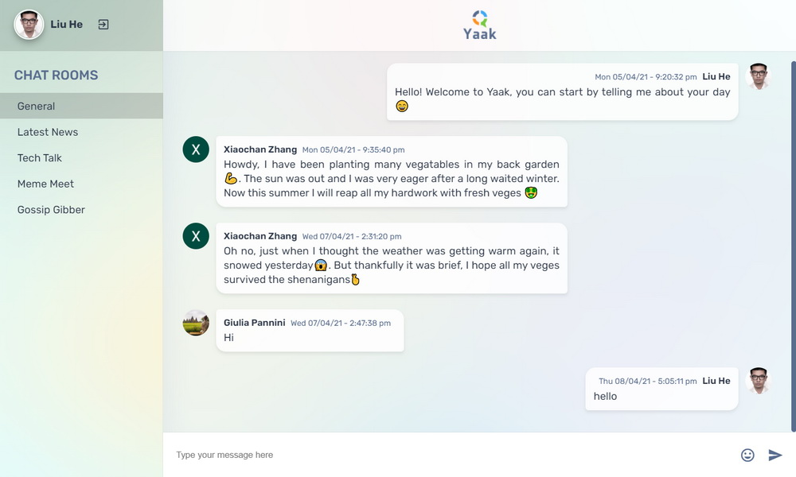

# Yaak

Yaak chatroom is an online chat app with multi-rooms support. Users can log in with Google or Facebook and chat to one another. It also supports emojis. Yaak was built with HTML, SASS and vanilla JavaScript, utilising Firebase for data storage and user authentication.

Live site: [https://yaak-aa6a6.web.app/](https://yaak-aa6a6.web.app/)

## Stack

## Key Features

- Multi-channels
- User auth with Oauth and Firebase
- Emojis
